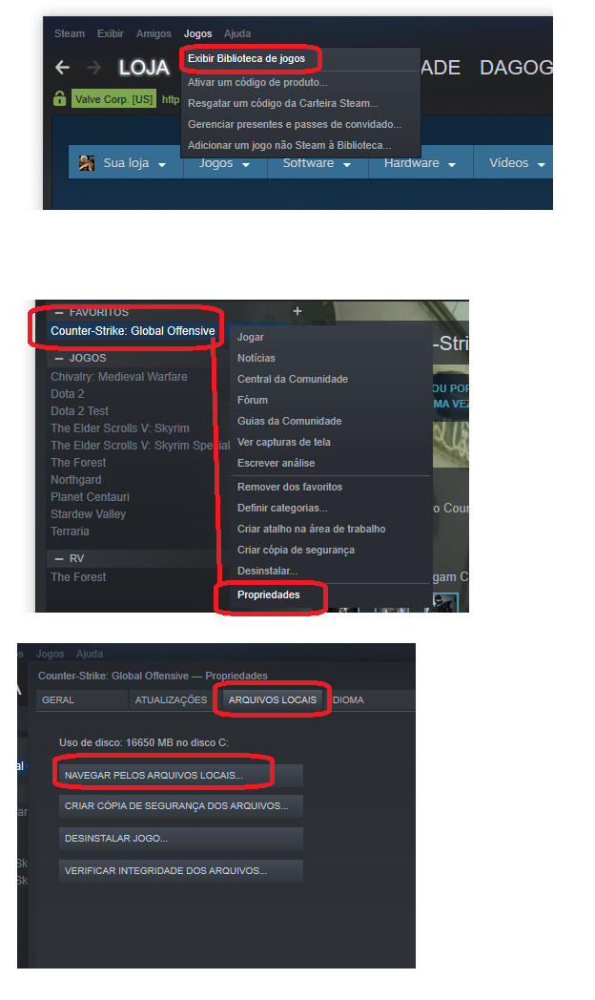
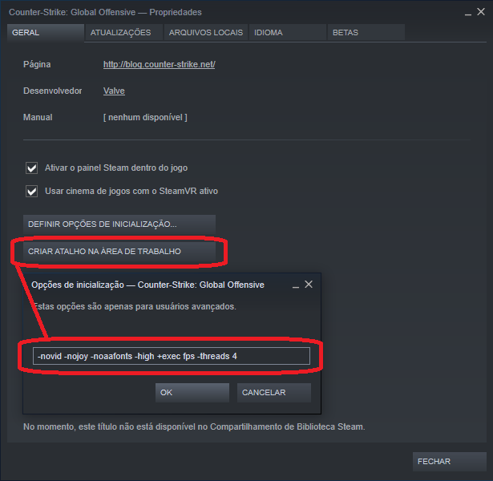

```
cd C:\Program Files (x86)\Steam\steamapps\common\Counter-Strike Global Offensive\csgo\cfg  
git clone https://github.com/gabrieldarezzo/fps_cs.git temp  
XCOPY /E /C /H /Y /i "temp" "C:\Program Files (x86)\Steam\steamapps\common\Counter-Strike Global Offensive\csgo\cfg"  
rmdir /S /Q temp\  
rmdir /S /Q .git  
rmdir /S /Q docs  
rmdir /S /Q README.MD  
```   


Para confirmar se o seu endereço é:     
"cd C:\Program Files (x86)\Steam\steamapps\common\Counter-Strike Global Offensive\csgo"   

   


Adicione as configurações abaixo:
Escolha um chamado/CARD da aba 'Sprint'.  
   

```
-novid -nojoy -noaafonts -high -console +exec fps -threads 4
```  

Explicação:  
"-novid" Remove a introdução da Valve ao iniciar o jogo;  
"-nojoy" Remove o suporte à joystick do CSGO;  
"-noaafonts" Previne o aliasing das fontes;  
"-high" Define o CSGO como Alta Prioridade nos processos do sistema;  
"-console" Libera o modo desenvolvedor (') ao abrir  
"+exec fps" Executa o arquivo fps.cfg ao iniciar   (veio do git)
"-threads 4" (Opcional) Habilita o uso dos Threads do processador;  


Na pasta:  
C:\Program Files (x86)\Steam\steamapps\common\Counter-Strike Global Offensive\csgo\cfg  

Agora possui o arquivo:  
fps.cfg  


Como ativo o console?
Ative o console em Ajuda e opções > Configurações do jogo > Ativar console de desenvolvedor.
Isso permitirá que você abra o console pressionando a tecla de aspa (‘)
